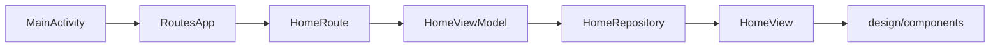

# NuCompose

Nubank home screen clone built with Jetpack Compose and Material 3, recreating the account dashboard with balance, shortcuts, credit, loan, insurance, and discovery sections. Based on [TiagoDanin/NuCompose](https://github.com/TiagoDanin/NuCompose), reorganized with feature-based MVVM, Koin, and Navigation Compose. UI state is driven by a single home feature; data comes from a centralized mock repository with no network layer.

## Structure



## Stack

| Technology | Version |
|------------|---------|
| Android Gradle Plugin | 9.4.0 |
| Kotlin | 2.2.10 |
| Compose BOM | 2026.02.01 |
| Koin | 4.2.2 |
| Navigation Compose | 2.9.3 |
| compileSdk / targetSdk | 37 |
| minSdk | 29 |
| JVM | 21 |

## Architecture

Feature-based MVVM with Koin for dependency injection.

```
src/
├── di/
├── routes/
├── design/
│   ├── theme/
│   └── components/
└── features/home/
    ├── models/
    ├── repositories/
    ├── view_models/
    ├── views/
    └── routes/
```

## ScreenShots

| Image 1 | Image 2 | Image 3 |
|----------|----------|----------|
|  |  |  |

| Image 4 | Image 5 | Image 6 |
|----------|----------|----------|
|  |  |  |

## Commits

```
git add . && git commit -m ":rocket: Initial commit." && git push
git add . && git commit -m ":building_construction: Added initial project architecture." && git push
git add . && git commit -m ":building_construction: Update project architecture." && git push
git add . && git commit -m ":memo: Updated project documentation." && git push
git add . && git commit -m ":memo: Updated code documentation." && git push
git add . && git commit -m ":white_check_mark: Added feature xyz." && git push
git add . && git commit -m ":wrench: Fixed xyz usage." && git push
git add . && git commit -m ":heavy_minus_sign: Removed xyz." && git push
git add . && git commit -m ":memo: Adjusted project imports." && git push
git add . && git commit -m ":arrow_up: Updated dependencies." && git push
git add . && git commit -m ":arrow_down: Removed dependencies." && git push
git add . && git commit -m ":wastebasket: Removed unused code." && git push
git add . && git commit -m ":test_tube: Added test functionality xyz." && git push
git add . && git commit -m ":construction_worker: Building in progress." && git push
git add . && git commit -m ":construction_worker: Added CI build system." && git push
```

## License

[MIT License](https://opensource.org/licenses/MIT)

Copyright (c) 2026 William Franco.
